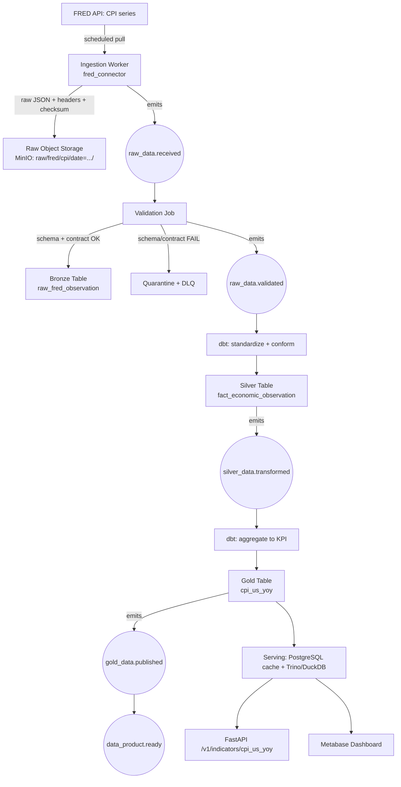

# Solution Design Document (SDD)

**What this document answers:** given the principles and patterns in `ARD.md`, what is the concrete, end-to-end solution — which specific technology per layer, what data flows where, and what does deployment look like across phases?
**How it differs from its neighbors:** `ARD.md` says "Lakehouse with a Bronze/Silver/Gold Medallion pattern and separated compute/storage"; this document says exactly which product fills each slot in Phase 1 versus Phase 3, and shows the full flow for one worked example end to end.

## 1. End-to-end data flow (worked example: daily CPI from FRED)



Every arrow labeled with an event corresponds to an entry in `../technical/event-schema.md`. Every table named here has its full column definition in `../technical/data-model.md`.

## 2. Technology chosen per layer, and what was rejected

| Layer | Chosen (Phase 1 / MVP) | Chosen (Phase 3 / Cloud) | Rejected alternative | Why rejected |
|---|---|---|---|---|
| Ingestion | Python connector scripts, one per source, scheduled by Dagster | Same code, containerized, scaled via Kubernetes CronJobs/sensors | A single monolithic "fetch everything" script | Violates separation of concerns (ARD §2.3); impossible to retry or scale one source independently |
| Event notification | In-process function calls / local lightweight queue | Apache Kafka | Kafka from day one | Operational overhead with no payoff at MVP's connector count — see ADR-0002 |
| Raw storage | MinIO (local S3-compatible container) | Cloud object storage (S3-compatible) | Storing raw responses only in PostgreSQL | Warehouses/RDBMS are expensive and awkward for large, mostly-write-once raw blobs; also couples raw storage to serving storage, violating ARD §2.3 |
| Table format | Apache Iceberg + Parquet, via PyIceberg/DuckDB | Apache Iceberg + Parquet, via Trino | Delta Lake | Iceberg has stronger multi-engine (Trino/DuckDB/Spark) support without vendor coupling; see ADR-0003 |
| Transform | Python (parsing) + dbt Core (SQL modeling) | Same, plus Spark only if/when volume requires it | Doing all transforms in raw Python with no versioned SQL layer | Loses dbt's built-in testing, documentation, and lineage — reinventing this poorly |
| Serving DB | PostgreSQL (metadata, job state, API cache) | Managed PostgreSQL (e.g., RDS-equivalent) | Serving all historical OHLCV from PostgreSQL | Wrong storage profile for large columnar historical data (ARD §5) |
| Analytics SQL | DuckDB (query Iceberg/Parquet directly) | Trino (concurrent multi-user SQL federation) | Loading everything into a proprietary warehouse | Adds cost and a lock-in point not justified until concurrency actually requires it |
| API | FastAPI, single process | FastAPI, containerized, horizontally scaled | Exposing the database directly to consumers | No contract, no auth boundary, no rate limiting — a direct violation of ARD §2.7 |
| Orchestration | Dagster, local | Dagster, containerized (or Airflow, per ADR if switched) | Cron scripts with no dependency graph or retry semantics | No idempotent retry/backfill story, no run visibility |
| Identity | None (single local user) / API key | Keycloak + RBAC | Building custom auth | Reinventing a solved, security-critical problem |
| Secrets | `.env`, git-ignored | Vault or cloud secrets manager | Secrets in `docker-compose.yml` or code | Direct violation of ARD §2.7 |
| Observability | Prometheus + Grafana, local containers | Same, cloud-managed or self-hosted at scale | Log files only | No alerting, no trend visibility, fails NFR auditability targets |

## 3. Bronze / Silver / Gold — what changes at each layer (worked example continued)

| Layer | Table | What's preserved/added | Example |
|---|---|---|---|
| Bronze | `raw_fred_observation` | Parsed JSON, minimal type coercion, still one row per raw API observation, `source_id`, `retrieved_at`, `request_hash` | `{series_id: "CPIAUCSL", date: "2024-01-01", value: "308.417", realtime_start: "2024-02-13"}` |
| Silver | `fact_economic_observation` | Standardized units, `geography_code`, `frequency`, `unit`, `seasonal_adjustment`, `reference_period`, `methodology_version` — conformed so a Eurostat HICP row and a FRED CPI row are comparable | `{indicator_id: "cpi_us", geo_code: "US", period: "2024-01", value: 308.417, unit: "index_1982_84_100", vintage_date: "2024-02-13"}` |
| Gold | `cpi_us_yoy` | Business-ready KPI: year-over-year % change, ready for direct dashboard/API consumption | `{geo_code: "US", period: "2024-01", yoy_pct: 3.1}` |

This is precisely why CPI from FRED and HICP from Eurostat must **never** be mixed directly in a Bronze/Silver table without passing through this standardization — see `../technical/data-model.md` for the full field list that makes cross-source comparison safe.

## 4. Data contract (representative example)

```yaml
dataset: market_ohlcv_daily
owner: market-data-domain
source: licensed_or_official_provider
version: 1.0.0
primary_key:
  - source_id
  - instrument_id
  - interval
  - observed_at
freshness_slo: "available by 22:00 Europe/Berlin on trading days"
schema:
  observed_at: timestamp_utc
  open: decimal(20,8)
  high: decimal(20,8)
  low: decimal(20,8)
  close: decimal(20,8)
  volume: decimal(28,8)
quality_rules:
  - low_lte_open_lte_high
  - low_lte_close_lte_high
  - nonnegative_volume
  - primary_key_unique
change_policy:
  breaking_change_requires: major_version_and_consumer_approval
```

This contract lives in Git, is validated in CI, and must pass before the corresponding data product is published. See `../methodology/edd-sdd-tdd.md` for how this fits the Spec-Driven Development flow.

## 5. Phased deployment shape

### Phase 1 — Local MVP (laptop)

`docker-compose` running: Python connectors, PostgreSQL, MinIO, Dagster, dbt Core, DuckDB, Metabase, Prometheus, Grafana. No Kafka, no Kubernetes, no external IAM. Full detail and exit criteria: `../roadmap/mvp-plan.md`.

### Phase 2 — Team-ready

Add: Apache Kafka (once genuinely justified — ADR-0002), OpenMetadata, Keycloak, Vault, CI/CD (GitHub Actions), enforced data contracts in CI, and separate dev/staging/prod environments.

### Phase 3 — Cloud-native production

Add: managed Kubernetes, real cloud object storage, GitOps (Argo CD), autoscaling, backup/disaster recovery, enterprise IAM integration, and 24/7 monitoring/alerting.

The point of this staging, restated from `../01-executive-summary-and-recommendation.md`: the architecture does not change shape between phases — only the concrete infrastructure realizing each already-designed layer does.

## 6. Relationship to other documents

- Every technology choice in §2 with real trade-offs and rejected alternatives that matter beyond a one-line note has a full ADR in `decisions/`.
- Exact schemas: `../technical/data-model.md`. Exact API: `../technical/api-design.md`. Exact events: `../technical/event-schema.md`.
- Functional behavior this flow must satisfy: `../requirements/FRD.md` (e.g., FR-ING-001 for the FRED connector specifically).
